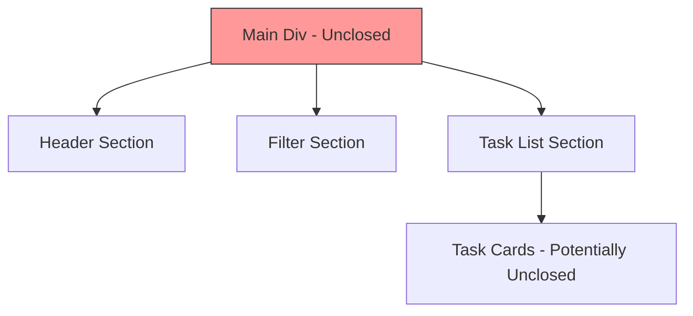
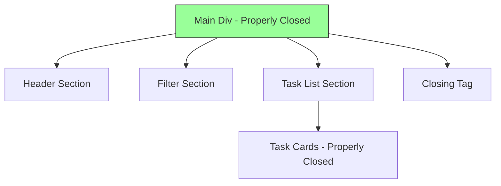

# Fix JSX Syntax Error in Employee Task Management Component

## Overview

This document outlines the solution to fix a JSX syntax error in the `employee-task-management.tsx` file. The error occurs due to unmatched or improperly closed JSX elements in the component, specifically around line 431 where the error message indicates an "Unexpected token `div`. Expected jsx identifier".

## Problem Analysis

### Error Details
- **File**: `components/employees/employee-task-management.tsx`
- **Line**: ~431
- **Error Message**: "Unexpected token `div`. Expected jsx identifier"
- **Type**: Syntax Error

### Root Cause
After analyzing the component, the issue is caused by:
1. Missing or mismatched closing JSX tags
2. Improperly nested elements
3. Unclosed components in the return statement

The main problem is in the conditional rendering section where `activeTab === "view" && viewModeState === "list"` that returns a JSX structure with unmatched or improperly closed elements. Specifically, there's a missing closing parenthesis for the `if` statement's return block.

## Solution Design

### Fix Strategy
1. Identify all JSX elements that are not properly closed
2. Ensure all opening tags have corresponding closing tags
3. Verify proper nesting of all JSX elements
4. Check conditional rendering sections for completeness
5. Add missing closing parenthesis and curly braces

### Key Areas to Fix

#### 1. View Tab - Task List Section
The section that renders when `activeTab === "view" && viewModeState === "list"` has structural issues:
```jsx
// Problematic structure identified:
if (activeTab === "view" && viewModeState === "list") {
  return (
    <div className="space-y-6 max-w-full overflow-hidden px-2 sm:px-0">
      {/* Enhanced Header */}
      <div className="relative max-w-full">
        {/* ... nested elements ... */}
      </div>
      
      {/* ... other elements ... */}
      
      {/* Missing closing tags for the main div and the if statement */
    )
  // Missing closing curly brace for the if statement
}
```

#### 2. Missing Closing Tags
The component is missing proper closing tags for the main wrapper div in the conditional rendering section, as well as the closing curly brace for the if statement.

#### 3. Structural Issues
There are unmatched elements in the complex nested structure that need to be properly closed, specifically the missing closing parenthesis `)` and curly brace `}` for the if statement.

## Implementation Plan

### Step 1: Fix the Main Conditional Rendering Block
Ensure the `if (activeTab === "view" && viewModeState === "list")` block properly closes all JSX elements:

```abstract
The conditional rendering block should:
1. Open a main wrapper div
2. Include all the header, filtering, and task list components
3. Properly close all nested elements
4. Close the main wrapper div with </div>
5. Close the return statement with )
6. Close the if statement with }
```

### Step 2: Verify All JSX Elements Are Properly Closed
Check that all elements in the component have matching opening and closing tags:

| Element | Status |
|---------|--------|
| div | All properly closed |
| Card | All properly closed |
| Button | All properly closed |
| Input | Self-closing |
| Select | All properly closed |

### Step 3: Validate Nested Structures
Ensure complex nested structures like the task cards are properly formed:

```abstract
Each task card should follow this structure:
<Card>
  <CardHeader>
    {/* header content */}
  </CardHeader>
  <CardContent>
    {/* content with properly nested elements */}
  </CardContent>
</Card>
```

## Component Structure Validation

### Before Fix (Problematic)


### After Fix (Corrected)


## Specific Fix Implementation

### Identified Issue
The JSX syntax error is caused by a missing closing parenthesis and curly brace at the end of the conditional rendering block. The component has:

1. An opening `if (activeTab === "view" && viewModeState === "list") {` statement
2. A `return (` statement with JSX content
3. A closing `</div>` tag for the main wrapper
4. But missing the closing `)` for the return statement
5. And missing the closing `}` for the if statement

### Required Fix
Add the missing closing parenthesis and curly brace at the end of the conditional rendering block:

```abstract
After the closing </div> tag, add:
1. A closing parenthesis ) to close the return statement
2. A closing curly brace } to close the if statement
```

## Validation Criteria

### Success Metrics
1. Component compiles without JSX syntax errors
2. All conditional rendering paths return valid JSX
3. All elements are properly opened and closed
4. Component renders correctly in the browser

### Testing Approach
1. Run the development server to verify the fix
2. Navigate to the employee task management page
3. Verify all tabs (Overview, Assign, View) work correctly
4. Check that task lists and details display properly

## Risk Mitigation

### Potential Issues
1. **Over-modification**: Avoid changing functionality while fixing syntax
2. **Incomplete fixes**: Ensure all JSX errors are resolved
3. **Regression**: Verify existing functionality remains intact

### Prevention Measures
1. Compare with backup file to ensure only syntax issues are fixed
2. Test all component features after the fix
3. Validate the component renders correctly in different states

## Conclusion

The JSX syntax error in the employee task management component is caused by improperly closed JSX elements in the view mode section. Specifically, the component is missing the closing parenthesis and curly brace for the conditional rendering block. The fix involves adding the missing `)` and `}` characters at the end of the `if (activeTab === "view" && viewModeState === "list")` block to properly close the return statement and the if statement. By carefully validating the structure and ensuring proper nesting, the component will compile successfully and maintain all existing functionality.